# Safe Agent Vault for Uniswap v4 (working title)

## What is this?

A risk-first "safety exoskeleton" for Uniswap v4 agents:
- Funds sit in a SafeAgentVault smart contract.
- Each agent address has a risk profile (limits, allowed pools, modes).
- Off-chain rule-based agents send trade intents.
- The vault enforces on-chain guardrails before interacting with Uniswap v4.

## Status

- Phase 0: Dev environment setup ✅ / 🔄
- Phase 1+: Vault + risk config + Uniswap v4 integration (coming next)

## Quickstart: run the SafeAgentVault demo locally

This repository contains a minimal "safety exoskeleton" around Uniswap v4-style agents, built with Hardhat and a simple ERC20 vault.

You can run all tests and a full local demo with:

```bash
npm install
npx hardhat test

# run a full end-to-end demo on a local Hardhat network
TMPDIR=~/hh-tmp npx hardhat run scripts/demoAgent.js
```

This script will:

- Deploy a mock ERC20 token (MockERC20) and a SafeAgentVault.
- Mint 1000 mUSD to a user, approve and deposit all into the vault.
- Configure an agent with:
  - an ENS-like label (agent.safe.eth)
  - a whitelist of allowed pools
  - a per-trade notional limit (maxNotionalPerTrade)
- Allocate 200 mUSD from the user's main balance into the agent sub-account.
- Let the agent call executeSwap(...), which passes the on-chain risk checks and emits an AgentSwapExecuted event.

This demonstrates the full flow:

**User → Vault → Agent limits → Trade intent → Risk shell decision**

even before wiring the vault into a real Uniswap v4 PoolManager.

## Architecture: "safety exoskeleton" for Uniswap v4 agents

The core idea of this project is to separate **"risk shell"** from **"strategy brains"**:

- Users deposit ERC20 assets into `SafeAgentVault`.
- Each agent gets a **per-user sub-account** via:
  - `mapping(address => mapping(address => uint256)) agentBalances;  // user -> agent -> amount`
- The owner configures per-agent limits through:
  - `maxNotionalPerTrade` (per-trade notional cap)
  - a whitelist of allowed pools
  - (future) daily limits, leverage flags, etc.
- Off-chain agents only send **intents**, such as:
  - "swap X amount in pool P, direction D"
- The vault enforces **on-chain guardrails** before any execution:
  - the agent is enabled
  - the target pool is whitelisted
  - the trade amount ≤ `maxNotionalPerTrade`
  - the agent has enough allocated balance in `agentBalances[user][agent]`

In the current phase:

- `executeSwap(...)` acts as a **stub**:
  - it validates risk constraints
  - it emits `AgentSwapExecuted(agent, user, ensNode, routeId, pool, zeroForOne, amountIn, amountOut)`
  - it does **not** yet call a real Uniswap v4 PoolManager

In the next phase, this stub will be wired into:

- a minimal Uniswap v4 deployment (PoolManager + a simple pool)
- with the same vault-level risk checks in front of every swap,
- so Uniswap agents can "fight" in a sandbox **without having direct custody of user funds**.

This makes the vault a reusable **safety layer** that different agent strategies can plug into, instead of each strategy having to re-implement its own ad-hoc risk checks.

Visually, the system is organized as a three-layer flow:

- **Left:** Users / dApps interact with the system and submit high-level intents.
- **Center:** `SafeAgentVault` holds custody of funds, manages per-user and per-agent balances, and enforces risk limits.
- **Right:** A Uniswap v4 sandbox (PoolManager + pools) executes swaps, always behind the vault's safety shell.

The following diagram summarizes this architecture:


## ENS-aware Agent Identity (Optional, Sponsor-facing)

SafeAgentVault supports **ENS-based agent identity** for improved readability, auditability, and optional enforcement:

- Each agent can be associated with an **ENS node** (bytes32 namehash) via `AgentConfig.ensNode`
- The `ensNode` is emitted in all `AgentSwapExecuted` events for off-chain tracking and UI display
- **Optional on-chain enforcement**: The vault owner can set an ENS Registry address via `setENSRegistry(address)`
  - When configured, `executeSwap()` validates that `msg.sender` matches the on-chain owner of the ENS node
  - This prevents unauthorized agents from impersonating registered identities
  - By default (`ensRegistry = address(0)`), ENS validation is disabled for local testing

### ENS Integration Benefits

- **Readability**: Instead of `0x3C44...93BC`, display `agent.safe.eth` in UIs and audit logs
- **Auditability**: All swap events include the ENS node, making it easy to filter by agent identity
- **Sponsor alignment**: Demonstrates integration with ENS (Ethereum Name Service) for decentralized identity
- **Optional enforcement**: Production deployments can enable on-chain ENS ownership verification

### ENS Resources

- Official ENS documentation: [docs.ens.domains](https://docs.ens.domains)
- ENS Registry (Mainnet): `0x00000000000C2E074eC69A0dFb2997BA6C7d2e1e`
- Namehash specification: [EIP-137](https://eips.ethereum.org/EIPS/eip-137)
- **ENS Resolution Tool**: See `tools/ens_resolve.mjs` for resolving ENS names and computing namehashes

### Example Usage

```solidity
// Configure agent with ENS node
bytes32 ensNode = keccak256(abi.encodePacked("agent.safe.eth"));
vault.setAgentConfig(agentAddress, true, ensNode, allowedRoutes, maxPerTrade);

// Optional: Enable ENS enforcement (production only)
vault.setENSRegistry(0x00000000000C2E074eC69A0dFb2997BA6C7d2e1e);

// Now executeSwap() will verify msg.sender == ENS owner
```

## Uniswap v4 Agentic Prize Alignment

This project targets the **"Uniswap v4 Agentic Finance"** prize track with the following key alignments:

### Safety Layer for Autonomous Agents

- **Non-custodial agent architecture**: Agents never hold user funds directly
- **On-chain risk enforcement**: All trades pass through vault-level guardrails before execution
- **Per-agent risk profiles**: Configurable limits (notional caps, pool whitelists, daily limits)
- **Sub-account isolation**: Each user-agent pair has isolated balance tracking via `agentBalances[user][agent]`

### Uniswap v4 Integration

- **Native v4 PoolManager integration**: Direct swap execution through Uniswap v4's hook-enabled architecture
- **Route-based trading**: Uses `routeId` (bytes32) to encapsulate pool parameters (token0, token1, fee, pool address)
- **Slippage protection**: Enforces `minAmountOut` on every swap
- **Event-driven auditability**: Emits `AgentSwapExecuted` with full trade details for off-chain monitoring

### Reproducible Demo

- **End-to-end local testing**: Full demo script (`scripts/demoAgent.js`) deploys contracts, configures agents, and executes swaps
- **Comprehensive test suite**: 23 passing tests covering vault operations, agent limits, and swap execution
- **Mock v4 environment**: Includes simplified PoolManager and PoolSwapHelper for local development
- **Python agent toolkit**: Reference implementation with policy engine, state monitoring, and manual swap execution

### Upgrade Path

- **Modular design**: Vault logic separated from swap execution (via `IPoolSwapHelper` interface)
- **ENS integration ready**: Optional identity verification for production deployments
- **Route registry**: Centralized route management with enable/disable controls
- **Hook compatibility**: Architecture designed to work with Uniswap v4 hooks for advanced strategies

### Key Differentiators

- **Risk-first approach**: Safety checks happen on-chain, not in agent code
- **Reusable safety shell**: Multiple agent strategies can share the same vault infrastructure
- **Transparent operations**: All agent actions logged on-chain with ENS-aware event emissions
- **Sponsor alignment**: Integrates ENS for identity, targets Uniswap v4 for execution

## Phases (Evolution Map)

```mermaid
graph LR
    A[Phase 0: Setup] --> B[Phase 1: Basic Vault]
    B --> C[Phase 2: Agent Limits]
    C --> D[Phase 3: Risk Config]
    D --> E[Phase 4: Uniswap v4 Integration]
    E --> F[Phase 5: ENS + Routes]

    A:::phase0
    B:::phase1
    C:::phase2
    D:::phase3
    E:::phase4
    F:::phase5

    classDef phase0 fill:#e1f5e1,stroke:#4caf50,stroke-width:2px
    classDef phase1 fill:#e1f5e1,stroke:#4caf50,stroke-width:2px
    classDef phase2 fill:#e1f5e1,stroke:#4caf50,stroke-width:2px
    classDef phase3 fill:#e1f5e1,stroke:#4caf50,stroke-width:2px
    classDef phase4 fill:#e1f5e1,stroke:#4caf50,stroke-width:2px
    classDef phase5 fill:#fff9c4,stroke:#fbc02d,stroke-width:3px

    style A text-align:left
    style B text-align:left
    style C text-align:left
    style D text-align:left
    style E text-align:left
    style F text-align:left
```



### Phase 0: Development Environment Setup ✅
- Hardhat project initialization
- Basic ERC20 mock contracts
- Test infrastructure

### Phase 1: Basic Vault Operations ✅
- `SafeAgentVault` contract with deposit/withdraw
- User balance tracking: `balances[user]`
- ERC20 custody and accounting

### Phase 2: Agent Sub-accounts ✅
- Per-user, per-agent balance allocation: `agentBalances[user][agent]`
- `allocateToAgent()` and `deallocateFromAgent()` functions
- Agent spending tracking: `agentSpent[user][agent]`

### Phase 3: Risk Configuration ✅
- `AgentLimits` struct with `maxPerTrade`, `dailyLimit`, `canUseLeverage`
- `setAgentLimits()` for owner-controlled risk profiles
- `consumeAgentBalance()` with limit enforcement

### Phase 4: Uniswap v4 Integration ✅
- Mini v4 PoolManager deployment
- `PoolSwapHelper` for swap execution
- `executeSwap()` with real on-chain swaps
- `AgentSwapExecuted` event emission

### Phase 5: ENS Identity + Route Registry 🔄 (Current)
- **Phase 5.1**: Route-based trading with `routeId` (bytes32)
  - `Route` struct: token0, token1, fee, pool, enabled
  - `setRoute()` and `setDefaultRouteId()` functions
  - `AgentConfig.allowedRoutes` whitelist
- **Phase 5.2**: ENS integration for agent identity
  - `AgentConfig.ensNode` (bytes32 namehash)
  - Optional `ensRegistry` for on-chain ownership verification
  - ENS-aware event emissions
- **Phase 5.3**: Enhanced event structure
  - `AgentSwapExecuted` includes `ensNode` and `routeId`
  - Improved auditability and UI integration

### Future Phases (Roadmap)
- **Phase 6**: Multi-asset support (multiple ERC20 tokens)
- **Phase 7**: Advanced risk controls (daily limits, cooldowns, circuit breakers)
- **Phase 8**: Hook integration for custom strategies
- **Phase 9**: Governance and decentralized agent registry
- **Phase 10**: Production deployment and audits
